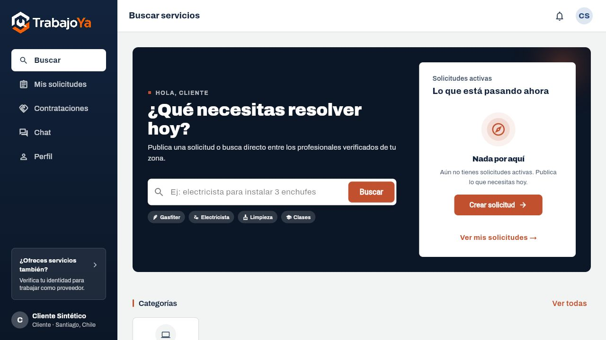

# TrabajoYa — marketplace de servicios

Proyecto personal de **Ignacio Garrido**, Ingeniero en Informática titulado. Desarrollo propio de la aplicación; librerías, plantillas, datos e imágenes de terceros conservan su autoría.

Código fuente de backend FastAPI/PostgreSQL/PostGIS y frontend Flutter/Dart, reunidos en `backend/` y `frontend/`. Incluye usuarios, JWT, servicios, categorías, solicitudes, propuestas, contrataciones, reseñas y chat WebSocket.

## Estado de esta entrega
Comprobados `/health`, OpenAPI (99 rutas), **40 pruebas backend** con PostgreSQL 16/PostGIS 3.6, **37 pruebas Flutter**, análisis estático sin avisos y build web. En navegador se verificaron inicio de sesión, catálogo y detalle con cuentas y servicio sintéticos. Las integraciones de pagos, email y proveedores externos no se validaron.



## Demo preparada con datos sintéticos
Requiere Docker Compose y Flutter. La revisión usó PostgreSQL/PostGIS local nativo, sin Docker; el contenedor no se ejecutó. Desde `backend/`:
```powershell
Copy-Item .env.example .env
```
Genera un JWT_SECRET_KEY local aleatorio y configura ese valor en `.env`; mantén vacías las credenciales de pagos/email. Después:
```powershell
docker compose -f compose.demo.yml up --build -d
docker compose -f compose.demo.yml exec -e DEMO_PASSWORD=UnaClaveDemoLocal123 api python -m app.portfolio_demo
```
El inicializador solo acepta base local `trabajoya_demo`, crea el esquema actual y rechaza bases con usuarios. Crea cliente@example.com, proveedor@example.com y un servicio ficticio; no toca bases existentes ni producción. La clave del ejemplo es pública y solo para este entorno local. PostgreSQL y API se exponen exclusivamente en loopback.

Desde `frontend/`:
```powershell
powershell -NoProfile -File preparar-demo.ps1
flutter pub get
flutter run -d chrome --web-port 3000
```
Abre localhost:3000 y usa una cuenta sintética. La configuración copiada apunta a localhost:8000/api/v1. Los assets `.env.*` de Flutter contienen solo API_URL y campos públicos vacíos: nunca claves privadas.

## Comprobaciones independientes de la base
```powershell
cd backend
python -m pip install -r requirements.txt
python demo_check.py
```
Las pruebas de `tests/` requieren PostgreSQL/PostGIS local y `TEST_DATABASE_URL` con base trabajoya_demo; nunca reutilizan automáticamente DATABASE_URL. Ejecuta `python -m pip install -r requirements-dev.txt` y `python -m pytest -q`. Resultado: 40 aprobadas. Se sustituyeron seis pruebas obsoletas de banca/payout por una comprobación de que sus rutas retiradas devuelven 404; no se agregó ni verificó un flujo de transferencias.

## Pagos y límites
El código contiene MercadoPago para suscripciones/conexión de proveedores, Fintoc y Webpay Plus. Su presencia acredita integración de código, **no cobros operativos, escrow, fondos custodiados, usuarios o ingresos**. Esta demo se recorre sin pagos, email, geocoding ni proveedores externos. No se validaron esas integraciones y necesitan revisión específica antes de usarlas.

## Configuración y credenciales
Se encontraron URLs con credenciales embebidas en scripts auxiliares originales; se retiraron de esta entrega. Cambia las credenciales originales en el proveedor. Esta copia excluye .git, entornos, bases, claves privadas y configuración de producción; no convierte el historial original en seguro. Mantén todos los secretos fuera del frontend. Ver `THIRD_PARTY.md` y el informe general de preparación.

English: Flutter/FastAPI service marketplace source with a prepared isolated synthetic-data environment. Verified 40 PostgreSQL/PostGIS backend tests, 37 Flutter tests, web build and synthetic login/catalog flow. External payment integrations remain unverified.
